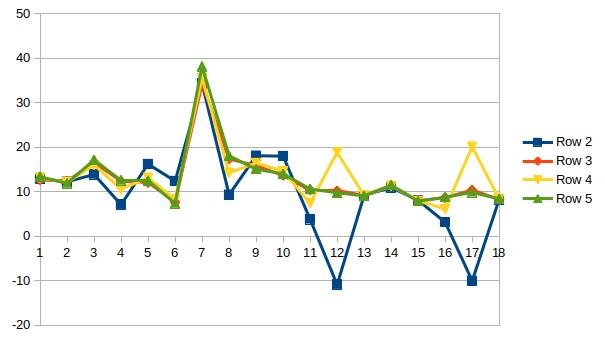

# SFND 3D Object Tracking

Welcome to the final project of the camera course. By completing all the lessons, you now have a solid understanding of keypoint detectors, descriptors, and methods to match them between successive images. Also, you know how to detect objects in an image using the YOLO deep-learning framework. And finally, you know how to associate regions in a camera image with Lidar points in 3D space. Let's take a look at our program schematic to see what we already have accomplished and what's still missing.

In this final project, you will implement the missing parts in the schematic. To do this, you will complete four major tasks: 
1. First, you will develop a way to match 3D objects over time by using keypoint correspondences. 
2. Second, you will compute the TTC based on Lidar measurements. 
3. You will then proceed to do the same using the camera, which requires to first associate keypoint matches to regions of interest and then to compute the TTC based on those matches. 
4. And lastly, you will conduct various tests with the framework. Your goal is to identify the most suitable detector/descriptor combination for TTC estimation and also to search for problems that can lead to faulty measurements by the camera or Lidar sensor. In the last course of this Nanodegree, you will learn about the Kalman filter, which is a great way to combine the two independent TTC measurements into an improved version which is much more reliable than a single sensor alone can be. But before we think about such things, let us focus on your final project in the camera course. 

## Dependencies for Running Locally
* cmake >= 2.8
  * All OSes: [click here for installation instructions](https://cmake.org/install/)
* make >= 4.1 (Linux, Mac), 3.81 (Windows)
  * Linux: make is installed by default on most Linux distros
  * Mac: [install Xcode command line tools to get make](https://developer.apple.com/xcode/features/)
  * Windows: [Click here for installation instructions](http://gnuwin32.sourceforge.net/packages/make.htm)
* Git LFS
  * Weight files are handled using [LFS](https://git-lfs.github.com/)
* OpenCV >= 4.1
  * This must be compiled from source using the `-D OPENCV_ENABLE_NONFREE=ON` cmake flag for testing the SIFT and SURF detectors.
  * The OpenCV 4.1.0 source code can be found [here](https://github.com/opencv/opencv/tree/4.1.0)
* gcc/g++ >= 5.4
  * Linux: gcc / g++ is installed by default on most Linux distros
  * Mac: same deal as make - [install Xcode command line tools](https://developer.apple.com/xcode/features/)
  * Windows: recommend using [MinGW](http://www.mingw.org/)

## Basic Build Instructions

1. Clone this repo.
2. Make a build directory in the top level project directory: `mkdir build && cd build`
3. Compile: `cmake .. && make`
4. Run it: `./3D_object_tracking`.

## Performance Evaluation

All the experiment results are found in matching_3D_project.xlsx.

#### LIDAR TTC
For the lidar ttc without any adjustments to the code, one can see that it has 3 unreasonable measurements,
at frame 7, 12 and 17. These measurements are unreasonable 
because if one obseves the 3D viewer he can see that the proceeding car is always approaching at a contant rate, 
this means the ttc should be relatively constant or slightly decreasing.
in frame 7, I think the value is too high, 
and for frames 12 and 17 the value is negative which can't happen when a car is approaching.

The reason for this is that some outlier measurement are found between the ego
and proceeding car, which can happen because of dust or rain. 
One solution is to remove the closest point and look at the second closest. This solution was tested 
and it's results are saved in the second row of the results file. 
It can be seen that negative estimations are removed which is great.

The first solution assumes that there is only one outlier which is not always the case, 
to make the solution more robust one can take an average of N closest points and 
use that average as the distance estimate. The results of this solution are found in the third and fourth row of the result file.
It can be seen that this method gives smother TTC estimates compared to the solution of removing the minimum.

This figure summaries the LIDAR TTC results
 

#### Camera TTC

The best keypoint detector is FAST because it's ttc estimation is smooth using all discriptors.
One reason for this is because of high number of matching pairs which will help give 
a more robust median calculation for the ttc calculation.
an other good keypoint detector is AKAZE which was shown in the previous assignment that 
it had the highest percentage of inliers which means the keypoints themselves are suited for the task.

one figure for each keypoint detector is available in the repo. 

    
